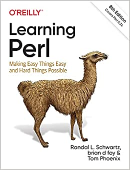

# Learning Perl, 8th Edition 
### by Randal L. Schwartz, brian d foy, Tom Phoenix
 

	

 
 

# Book Description
If you're just getting started with Perl, this is the book you want—whether you're a programmer, system administrator, or web hacker. Nicknamed "the Llama" by two generations of users, this best seller closely follows the popular introductory Perl course taught by the authors since 1991. This eighth edition covers recent changes to the language up to version 5.34.  

Perl is suitable for almost any task on almost any platform, from short fixes to complete web applications. Learning Perl teaches you the basics and shows you how to write simple, single-file programs—roughly 90% of the Perl programs in use today. And each chapter includes exercises to help you practice what you've just learned. Other books may teach you to program in Perl, but this book will turn you into a Perl programmer.  

Topics include:
* Perl data and variable types
* Subroutines
* File operations
* Regular expressions
* String manipulation (including Unicode)
* Lists and sorting
* Process management
* Use of third-party modules
 
 

# Scripts
Here is the code snippets a wrote from book and answer of exercises through chapter **1** to **10** of the book.  

Please note that:  
* Book has **16** chapters, so the scripts are not complete
* I have modified some of the script, so they are not exact version of book.
 
 

# Downloading sample codes from official website
You can download script files from [Here](https://github.com/downloads/briandfoy/Learning-Perl-Sample-Files/Learning_Perl_sample_files.zip)
 
 

# Author github repository:
[Here](https://github.com/briandfoy/Learning-Perl-Sample-Files) is the gihub repository of author, you can give star and look the source codes of the book.